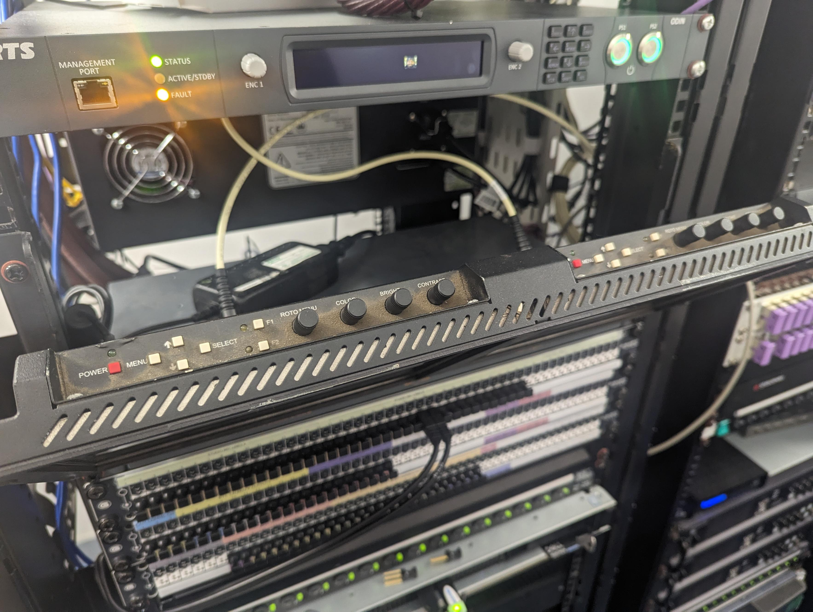

# Television Studio

## Startup and Shutdown Procedure

These steps are for a partial startup and shutdown. The TV Studio Technical Manager should be contacted for full startup and shutdown as there is critical infrastructure for DMM in the TV Studio. The shutdown procedure is the same as the startup procedure but in reverse.

### TAR

1.  In the middle of the center rack Power on MDU 4. This will turn on the CCUs.

    

2.  Underneath the CCUs, power on each power switch on the Sony vision mixer, one by one, a few seconds between each.

    

3.  (Optional) Switch on the two monitors in the left rack using the red power buttons on the top of each monitor.

    

### PCR (Front Row)

1.  In the rack closest to the TAR, turn on the vision mixer panel.

    

2.  At the bottom of that rack, turn on the speaker amp.

    

3.  Turn on any monitors that aren’t on.

### PCR (Back Row)

1.  At the engineering position (far left), reach through the empty rack and switch on the mains switch on the rear panel to the right of the rack.

    

2.  **To get tally to work from the vision mixer correctly, the Vision Mixer device in Cerebrum needs to be refreshed:**

    1.  Open Cerebrum on the Control PC (far left PC on the back row)

    2.  On the left side in the device panel, navigate to the Vision Mixer device (this has an IP 0.0.0.2)

    3.  Right-click on it and press ‘Edit Device’

    4.  Press ‘Modify’ at the bottom of the window that opens and it should refresh the device and the tally should work.

### SCR

1.  Behind the computer monitor to the right of the mixing desk, power on the sequential MDU. This will turn on all equipment in the room on sequentially to prevent any current overload or loud pops coming through the speakers.

    

### VCR

1.  Switch on the lighting desk using the power button on the rear right of the desk.

    

2.  Switch on the lighting monitor.

3.  Switch on the vision engineering monitor.

4.  Switch on the TV using the remote.