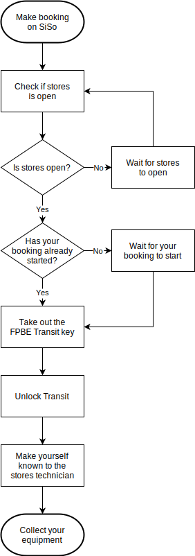
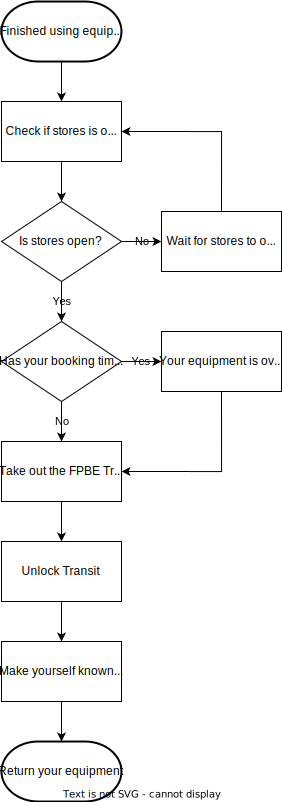
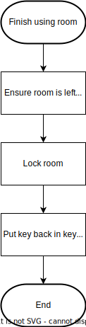

# Bookings

Bookings of the Department of Music and Media’s technical facilities and equipment are made via thee online booking system, SiSo. Within this system, you can make bookings or view existing bookings for facilities for which you have appropriate permissions. See the [DMM Booking Quick-Start Guide](https://surreyac.sharepoint.com/sites/msteams_36c291/Shared%20Documents/Forms/AllItems.aspx?id=%2Fsites%2Fmsteams%5F36c291%2FShared%20Documents%2FLinked%20guides%2FBooking%20system%2FDMM%20booking%20quickstart%20guide%20v2%2Epdf&parent=%2Fsites%2Fmsteams%5F36c291%2FShared%20Documents%2FLinked%20guides%2FBooking%20system&p=true&ga=1) for registration and further guidance on how to make a booking.

Please note that the online booking system only reserves facilities for your use, it does not give you permission to borrow the equipment; this permission must be obtained by completing the checkout process at the time of booking. The equipment is only available to book once the relevant health and safety assignment has been passed. Cameras and lights need appropriate risk assessments submitted in advance.

The use of technical areas for official teaching purposes takes precedence over all other uses. Apart from this the booking system is a "first come, first served" one, so planning well ahead is advised. It is, however, prudent to check that there are no "official" bookings missing before you make firm arrangements for your own sessions.

## Equipment Loan

Equipment booked on the booking system should be collected from stores during stores opening hours. The equipment will be checked out to you by a technician, and, if required a transit key will be loaned to you. Keep the transit store tidy and maximise the use of space as much as you can.

Please check the equipment is all present at the time of booking, and in particular make sure you have sufficient charged batteries and recordable media. It is recommend that you test and set up everything well before the shoot time. If there are multiple bookings over the weekend, you should make your own arrangements for equipment hand over, and make sure any media cards are available and batteries are charged for the next user. NOTE: that we have multiple quantities of certain items. They are all numbered, so make sure you **take the correct item** when collecting from the transit store.

You must return the equipment in person at the end of the booking, unless previously arranged with the stores technician. Any damage to the equipment should be pointed out to the technician. Only negligent loss and damage is chargeable, but if you have negligently damaged or lost equipment, you may be required to repay the cost of repairs or replacement. Please note that the equipment remains your responsibility until it is returned in person to the stores technician. In the case of multiple bookings, the cost of damage or loss may be shared if no one admits responsibility. It is recommended that students have their own hand-over process, where the equipment is checked as OK and signed for.

| Collecting | Returning |
| :---: | :---: |
|  |  |

## Room (Keys) Loan

[Use of Techincal Facilites](use-of-technical-facilities.md)

| Collecting | Returning |
| :---: | :---: |
|  |  |

## Length of bookings

Filming equipment has a usual maximum booking length of 3 days. Longer booking periods for larger projects can be arranged by request from the module leader or programme director.

## General principles for making bookings

The booking system works well when all participants are considerate of each other. To this end, the following guidelines apply:

- Plan your needs well in advance!
- Follow all guidance on bookings, risk assessments, safety and consent forms given in lectures.
- Only book what you need for the time period you need it.
  - Don't make defensive or greedy bookings.
- When making a booking, try to butt this up to other pre-existing bookings.
  - A spare hour between between bookings is likely to be wasted.
- If you need to make a booking and there is scarce equipment left unbooked, talk to the people who have already made bookings.
  - If you've already made a booking, think about whether you need everything you have booked, sometimes a small compromise can satisfy everyone.
- Studios and edit rooms must be returned to brochure-ready condition before the end of your booked time.
- Be excellent to each other. Then we'll all be happy.

## Use of the Sony F5 and F55 cameras

We are in the lucky position of having two F5 and one F55 cameras available to second and final years, with a selection of high end lenses. These cameras are intended for single camera cinematography, and not for multi-camera event coverage. The Panasonic AG-UX180 cameras are far more suitable for multi-camera use. To this end you may only book one of the F55 or F5 cameras at one time, unless you have permission in advance from the programme director or their representative. Full details of the shoot will need to be submitted before the booking is approved.

## Hard drive loan

The department has rugged hard drives available for long term loan. Please ask at stores if you would like to borrow one of these. You will be required to either return or return and rebook these at the end of the year. Second year students going on placement, and all final year students must return these. Loss of these drives will be chargeable.

## Non-attendance for edit room bookings

Following feedback from programme reps, it was felt that there was a need for a mechanism for being able to formally make use of an edit room where the individual who has booked it is not present within a reasonable time. It was decided that if the booker of an edit room is not present with 15 minutes of the start of a booking, another student may use the remainder of that hour.
