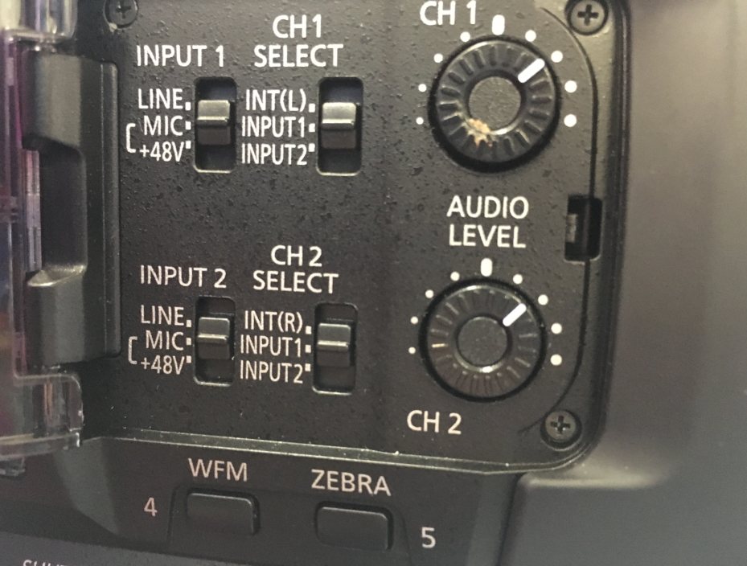

# Sound Devices MixPre-6 recorders and their use with the Panasonic AG-UX180

The department has six Sound Devices MixPre-6 recorders and one 788T. This guide explains how to get started, how to connect and set them up for filming and how to produce sound reports. It should be read in conjunction with the relevant manuals and quick start guides listed below:

- [The MixPre-6 User Manual](https://cdn.sounddevices.com/wp-content/uploads/2022/05/MixPre-I-User-Guide_050622.pdf)
- **WaveAgent** is a free, powerful Broadcast Wav header and metadata
editor. You can generate Sound reports from this. It runs on Mac or PC
and is used for files downloaded from the MixPre6 after recording.
[(Manual)](https://cdn.sounddevices.com/wp-content/uploads/2019/04/waveagent_en.pdf)
- **Wingman** is a free app for tablets and mobile phones. Apple and
Android versions are available. It allows you to see full meters for
all inputs, name tracks and files, and access transport controls over
Bluetooth. [(Manual)](https://www.sounddevices.com/wp-content/uploads/2019/04/WingmanUG_en.pdf)
- [The AG-UX180 User Manual](https://pro-av.panasonic.net/manual/pdf/AG-UX180P.PJ(DVQP1161ZA)_E.pdf)

## Connections

There is a decision to make here. You can use "tails" to record the mix onto the camera. This is the normal way of doing things, as it provides a useful guide for the editor. However it does mean you have a cable between camera and sound recorder which is sometimes inconvenient. So it is possible to use timecode only for sync. Here you can record a guide mono audio onto the camera using a wireless link and record all the mics and mix onto the MixPre-6. Note that this will then require synchronising in post using the timecode, clapper board and audio slate announcement. See the "Going wireless" section.

Tails are available for each recorder and camera combination. This document concentrates on the Panasonic AG-UX180.

The provided 3 metre audio cable connects the following. Make sure the camera is turned off until you have set the audio settings below.

- MixPre-6 mix output (mini-jack) to UX180 input (2 x XLRmale)
- UX180 headphone output (mini-jack) to MixPre-6 aux input (mini-jack)
- UX180 HDMI output (HDMI) to MixPre-6 HDMI TC (mini HDMI) (for timecode)

On the MixPre-6 there are 4 XLR mic inputs with switchable phantom power. These can be recorded individually to a SD card on the MixPre-6 along with the LR mix. Or alternatively you can use the MixPre-6 as a mixer only and record the LR mix onto the camera.

## Setting up the MixPre-6 and UX180

Settings can be changed on the MixPre-6 using the touch screen, and also by using the headphone level control. When in a menu this acts as a rotary encoder to choose a setting, then pressing the knob will enter or select an option.

One of the menu options is "**Presets**" and one of these is called "**Camera LR**". This will recall all the settings described here\ Under "Outputs" Make sure Mix L and Mix R is fed from Mix left and right.

Under "Inputs" Make sure Aux input is set to "Camera"

Under "Timecode" set the timecode input to HDMI TC             

On the camera, set the audio inputs to LINE and the levels as\ in the picture. Make sure Auto Level is off on the camera (never, ever use Auto level, set this to manual in the camera Audio menu)

Make sure Phantom power is turned off before you power up the camera.

To align the levels, look at the audio meters at the bottom of the camera pull out screen.

The vertical line represents -12dBFS, so send tone from the MixPre-6 at this level.

Adjust the AUDIO LEVEL pots on the camera so the meters read on the line. The pots should be in a similar position as shown in the picture on the previous page.

Before you turn off the tone, make sure the camera return feed to the MixPre-6 is working. This will allow you to check the recorded sound on the camera is good during recording. Select the Headphone icon on the home screen.

On the headphone preset page you can switch between LR stereo and Camera Stereo.

If you are recording sound separately, it is optional, but good practice to begin each project by recording a reference tone as a separate file. This should be at -18dBFS and last 20 seconds.

Remember to turn off the tone before you continue.

### Setting Mic Gains

Now connect the microphones and set the mic gains. NOTE: there are 2 level controls here per channel. The Mic **Gain** will set the mic level recorded to the track, and the **Fader** level will set that track's contribution to the LR mix. The 4 knobs on the front of the MixPre-6 can be pressed, and a setting menu will appear. This is called the "Channel Screen"

You can click on the "1:Ch1" to name the track. It is conventional to put the Boom first followed by clip/lav mics named with the person's name. NOTE the Wingman app can also be used to name tracks, and this is much easier. These names will remain when imported into editing software.

**Gain** is what you need to set the initial mic gain (input sensitivity). Use the meter to make sure it isn't clipping or so low to be noisy. The lights around the front panel knob will show the sensitivity, or you can use the Wingman app to show all of the levels on meters. You can also swipe on the MixPre-6 meters on the home screen to see all the levels.

Set **Phantom** to on if you are using a phantom powered mic and the **Low Cut** is useful when recording speech to get rid of air con and traffic rumble and other unwanted sound. Use approx 70Hz for male speech and 140Hz for female speech. NOTE: Radio mic receivers don't require phantom power.

You can also turn off the track on another page of this menu (press the 3 dots) - if you aren't using it, you won't end up with a blank track on the file. **Arm** is very important as it will then record this track when you go into record mode. Note that the recorded signal from a channel is **Pre-Fade** that means that only the **Gain** will affect the recorded level and not the **Fader**. When you are not in Gain mode, the front panel knob will set the **Fader** level. - this is the contribution level to the stereo mix, which you are recording as guide on the camera and as part of the recorded wav file. The **Pan** will set the position of this channel in the stereo mix. If you are just using one boom, set this to Centre. If you are using both boom and clip mics on a drama for example, where you will do a full sound edit and mix later, it is conventional to record booms onto L and clips onto R as a guide audio. If you aren't intending to do a full blown sound mix, then you should attempt to match the final mix here as well as you can. Recording individual mics locally though means you have full control later if you need it.

**NOTE:** If you are using only one or two mics for a relatively simple shoot, you can of course simply use the MixPre-6 as a mixer / mic amplifier and record everything onto the camera. This avoids having to resynchronise later. It is still very advantageous to use a separate audio device here, as the production sound mixer can keep a check of levels more easily, and the microphone amplifiers in the MixPre-6 are far superior to the ones in the camera, so you will get a better recording. If you do record the sound as separate files then you should always complete a **Sound Report**. See later for details on this.

### Timecode

Timecode is somewhat limited on the MixPre6. It can receive timecode from either the mini HDMI port (using Timecode over HDMI - as long as the camera supports it --- this isn't in the HDMI standard), or by using the Aux input mini jack for audio timecode (LTC). You can't output timecode from the Mix-Pre 6. You would need to use the Sound Devices 788T for full timecode features.

The Panasonic UX180 cameras support timecode over HDMI. The best way of using this is to set the internal generator in the UX180 to time of day timecode and set it to free run. In this way each take will get its own timecode in chronological order.

To set up the UX180:

- Set MENU --- RECORD SETUP --- TCG to "FREE RUN"
- Set MENU --- RECORD SETUP --- EXT TC LINK to "MASTER"
- Set MENU --- RECORD SETUP --- TC PRESET to current time of day.
- Set MENU --- OUTPUT SETUP --- HDMI TC OUTPUT to "ON"

You should see the incoming timecode on the MixPre6 display. Make sure the MixPre-6 timecode menu is set to HDMI

### Record Settings

Under the record menu you can set sample rate and bit depth. These should be set to 48kHz and 24bit

### Files

The MixPre6 will record a Polyphonic Broadcast Wav file (poly BWAV). A poly or multitrack wav has more than 2 tracks. The broadcast wav the same format as a normal wav file, but with an extended header featuring timecode, scene and take number, track names etc etc. You can set most of this within the MixPre6 before recording --- and you can edit it afterwards in the free WaveAgent software. This software can also split the multitrack bwav into individual mono files, if the editing system needs this.

The MixPre6 doesn't support Scene and Take naming (although WaveAgent does) --- but you can get round this by using the file name / number settings. These can be changed on the MixPre6 itself, or it is easier to use the Wingman App. You can also connect a USB keyboard to the MixPre-6 (see the manual for a handy list of keyboard shortcuts).

The file name can be a shortened name of project AND the scene number combined (e.g. PsychoScn3) and then the number can be the take number. You end up with a a file name like PsychoScn3-1.bwav This data will be used when generating the sound report. To name the *next* take before recording, press and hold the stop button. Pressing and turning the headphone knob during playback will scrub/shuttle through the audio The **Project** menu allows you to create a project to contain the BWAV files. This is simply a folder on the SD card.

## Going Wireless

Here you will be recording timecode onto camera and MixPre-6 using a lock-it box, and you can also record a guide mono audio track onto the camera using a wireless link. This set up is suitable for larger productions where you will be doing a full audio edit and mix. You will need lots of AA batteries!

### Connections

Ambient Lockit box to timecode in on the camera (via BNC connector) (see below) The same Ambient Lockit box to Aux in on the MixPre-6\ MixPre-6 Mix out to Sennheiser ew100 G3 transmitter in (using special cable) Sennheiser G3 ew100 receiver to camera audio input 1 via XLR\ NOTE: the transmitter is the one which has the Mute switch on the top

### Setting Up

In the MixPre-6 you can load the preset "**Camera TC**" to recall the settings outlined below. Firstly insert 2 x AA batteries into the Lockit box ACL203. You need to slide the top of the box as shown and push the metal plate down as you slide back.

To turn on the Lockit box, slide the top cover the other way and switch the yellow toggle switch towards the top plate.

The Red LED will flash once per second to show timecode is being generated. Make sure you have set the BCD switches correctly for the correct frame rate. Switch 3 should be set to position 2 for 25 FPS.

Now connect the Lockit box Timecode output to the Panasonic UX180 "TC preset in/out" connector with the small BNC cable. Do the following on the UX180 menus

Now disconnect the Lockit box From the UX180 and connect it to the MixPre-6 using the small BNC to mini-jack lead. This lead will now stay in place for the rest of the session. If you have a break, then be sure to resync the UX180 by following the procedure in the box above. You will also need to do this if you power down the camera to change battery for example.

**NOTE:** The timecode will start at zero from when you turn it on. If you want to use time of day timecode, you will need the Clockit Controller ACC501. You can then sync up the Lockit to this either with the supplied Lemo cable, or over Infra red on the IR menu.

On the MixPre-6, on the **Inputs** menu ensure the Aux in Mode is set to Timecode. And then on the **Timecode** menu set TC mode to Aux in 1. You should see the timecode being generated from the Lockit box now, and check to make sure it is the same as the camera display.

**NOTE:** Whilst this will give you the same initial timestamp on the video and audio file, it won't phase lock the exact speed of the camera and audio recorder together. So there may be some small drift over long periods. This shouldn't usually be a problem in most cases.

And now how to record the guide audio onto the camera.

On the **Outputs** menu. Make sure St. Out Left has both Mix L and Mix R lit up. This will let you send a mono of L and R to the camera wirelessly. If you only want to send one side of the stereo, then adjust here appropriately. Only the St Mix Left will be recorded on the camera.

Send **Tone** at -12dBFS from the Tone menu.

The Mix-Pre 6 mix output should be connected to the Sennheiser transmitter. This is using a special mini jack to mini jack cable. The tip (L channel) on the Mix output is connected to the Ring (line input) of the transmitter unit.

The Sennheiser receiver unit should be connected into Channel 1 Audio input. Set the camera to Mic input1 for both channels, without +48V phantom power. Set the tone to line up with the vertical line, as on page 3. The input pots should be roughly in the same place as shown below. Make sure Auto gain is off.

**NOTE:** Be sure to check this audio before you begin by listening on headphones plugged into the CAMERA. Remember it is a guide, and so won't be monitored constantly and may contain drop outs etc if the radio link goes bad. You will be recording the files onto the MixPre-6 which can be imported into the editing project at the same timecode as the picture. Use this camera guide audio as a sync reference in case of Timecode generator slippage.

You can use the Hot Shoe mount for the Sennheiser receiver.

When mounted onto the camera it should look like this.

## Sound Reports

A sound report should be generated whenever you record sound in a separate file to the picture file. The WaveAgent software can generate these electronically, or you can write them manually, as this is sometimes easier than poking at tiny screens! See our suggested template, or you can make your own. It should include:

### Header Section

- Production Title
- Date
- Location
- Name of Production Sound Mixer
- Make and Model of the recording device
- Bit depth and Sample rate
- Timecode frame rate
- Reference Tone level

### File List Section

Columns for:

- Filename
- Scene and Take number
- Print - mark "P" to print the take (should match the Scene / Take Log from the camera department) - The MixPre6 calls this "circled" - which is another way of indicating this, by circling the take on the form- 
- Timecode start - (a rough start time)
- Track assignments - what is on each track on that take- 
- Notes/comments - e.g. "Wild" if no picture.
