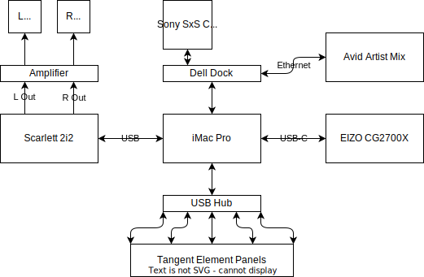

# Edit 9

This guide is intended to help in setting up and use of the edit/grading suite.

This room is bookable 24 hours, on the departmental booking system. Lone working is not allowed, and you should ensure someone is around to check on you if using the room late outside office hours. Working past 10pm requires the appropriate late night working pass.

The suite includes the following equipment:

- An Apple iMac Pro
- An Apple Thunderbolt Display
- An EIZO CG2700X 4K UHD Monitor
- A set of Tangent Element colour grading panels
- An Avid Artist Mix fader controller
- A Focusrite Scarlett 2i2 audio interface
<!-- - A BlackMagic Ultrastudio 4K -->

With the following software and plugin packages:

- Avid Pro Tools Ultimate
- Avid Media Composer
- Adobe Creative Cloud
- Sound Devices WaveAgent
- Blackmagic DaVinci Resolve Studio
- Izotope RX 8 Standard

## Systems Diagram

## General Guidelines when Editing

It is always preferable to use an external drive when editing audio or video. Avoid the system drive, and never use a network home drive for your source media. Make sure no drive is more than 80% full before starting a project. Drives which are nearly full WILL cause problems, and probably very cryptic error messages (Pro Tools definitely gives you cryptic error messages) Make sure you save the Project or Session regularly, and do a “Save As” at key points, so you have multiple copies you can go back to in case of corruption.

## DaVinci Resolve

### Project Management with Databases

### Colour Management with the EIZO Monitor

## Pro Tools

### Hardware and Audio Setup

It is recommended that you use the Focusrite Scarlett for audio in Pro Tools, and EIZO monitor as the video output.

In Pro Tools, go to **Setup -> Playback Engine** and choose Scarlett 2i2 USB. The session will quit and reopen if you need to change this. Also make sure the video engine is enabled here. The output of the Scarlett 2i2 can be listened to by selecting **AUX** on the Marantz amplifier at the bottom of the rack. Both the Scarlett 2i2 monitor volume and the amplifier volume need to be up.

<!-- The UltraStudio 4K should be automatically recognised by Pro Tools and the video should be present on the Sony monitor, using the SDI 1 input. Settings can be changed in the “Desktop Video Setup” program. -->

The Avid Artist Mix should connect automatically. Power on with the button top right. It is
enabled in **Setup —> Peripherals** and the **Ethernet Controllers** tab. Make sure the box **Enable
EUCON** is ticked.

### Outputs and Buses Setup

Go to **Setup -> I/O** and you can set up the inputs outputs and buses.

The Scarlett 2i2 only has 2 inputs and two outputs, so only one stereo Path will be active on both the Input and Output page. On the **Bus** page you can create as many internal buses as you need.

If you want to map these to physical outputs you need to tick the box here and choose the output you set up on the Output page.

### Creating a Session

Note, the file which contains all the edits and settings is called a “Session” file. The audio files are separate and are not changed by the editing process. A “project” is the term now used by Avid for a cloud based collaborative session using Avid’s cloud.

You must choose the correct sample rate when you create the project. This can’t be changed afterwards. Usually this will be 48kHz.