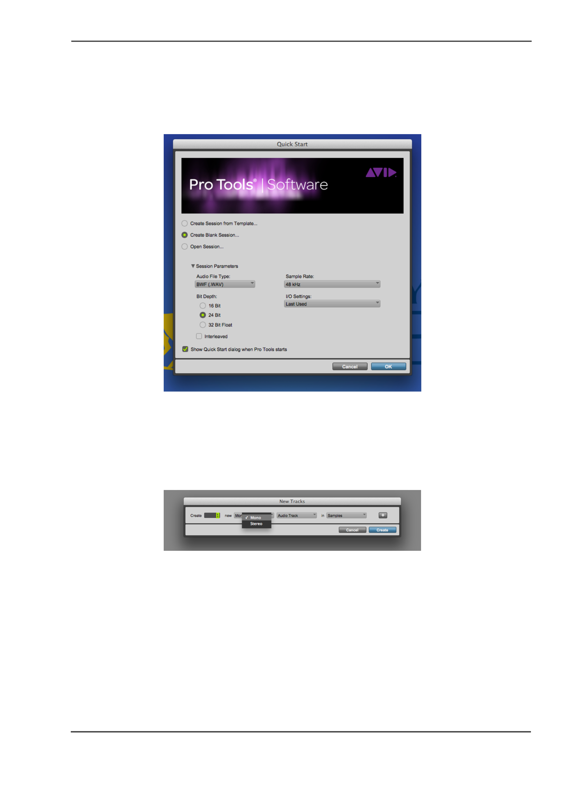
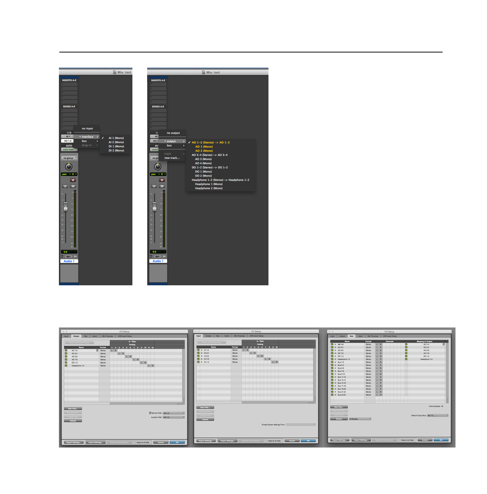
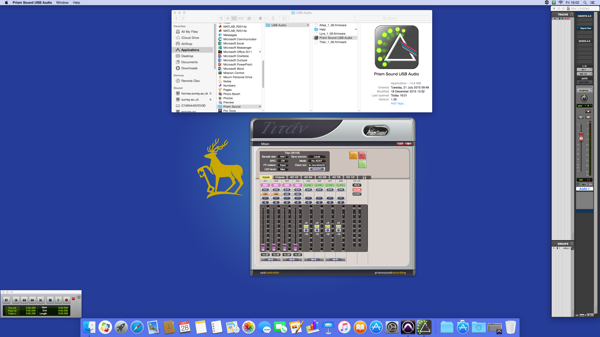
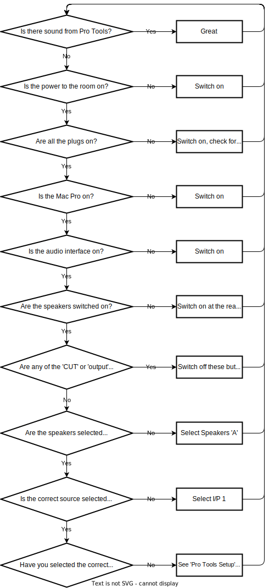

# PATS Edits 4 and 5

Access to the edit suite is via the PATS upper foyer. The room is bookable on SiSo and the key can be collected from the PATS key locker. For out of hours working an out of hours form must be completed and returned to the PATS technical store before the start of the booking. Lone working is not allowed out of hours. Edit 4 has a Mac Pro running Logic Pro and Pro Tools, with Prism sound audio interface, a Drawmer monitor controller and a Rode NT1 permanently located in the voice booth. Edit 5 is very similar to Edit 4 and is also suitable for recording voiceover if you would prefer to record with the artist in the room or are recording yourself. The steps in this document apply to Edit 5 as well. The manual for the monitor controller can be found here.

## Recording Voiceover in Edit 4

This guide is intended for quick reference and fault finding when recording voiceover in the department of music and media facilities, and is not intended as a guide to the art and science of recording the human voice.

### Setting up Pro Tools

Upon opening Pro Tools the quick start menu will appear, or you can create a new session. Make sure that you are using the intended sample rate and bit depth. To create tracks go to the Track menu and click new track. You can select the type of track, and whether it is mono or stereo Tracks must have inputs and outputs assigned. To call up the mixer go to the Window menu and select mixer.

To Open the I/O setup go to the Setup menu and select I/O Check that inputs, outputs and busses are setup as above. If there is no routing at all try pressing default. If there is still no routing you will have to create the paths manually using the 'new path' button. If the options on the top row are not available you may have pro tools set to the wrong playback engine. Go to the Setup menu, select '**Playback engine**' and ensure that the Prism sound interface is selected. It may say 'internal' or 'pro tools aggregate' which will need to be changed. The session will need to be reopened if you change the playback engine.

### Recording in Pro Tools in Edit 4

To adjust the mic gain in the preamp you will need to access the prism sound interface via Applications \> Prism Sound \> USB Audio \> Prism Sound USB Audio.

### Using headphones in the Booth in Edit 4

To provide your artist with fold-back you will need to use your own headphones or book headphones from the technical store. The jack plugs in the booth are fed from the headphone output of the monitor controller. You can monitor what your artist can hear by plugging headphones directly into the monitor controller in the control room. You will be able to talk to your artist using the talkback panel.

### Fault Finding in Edit 4

