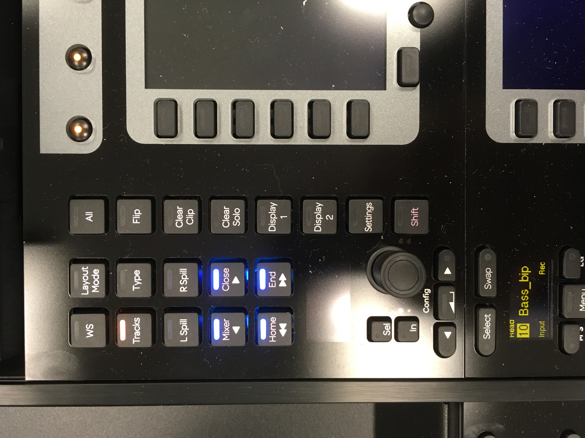
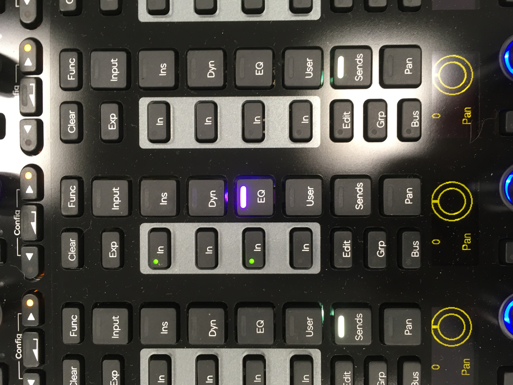

# Avid S6 Suite (21 AC 01)

## Introduction

This room is a temporary home for the Avid S6, which will later be installed in 14AC01 as a Dolby Atmos certified surround sound mixing studio. The room has limitations, most notably the large background noise caused by the air conditioning, but I have rigged it up temporarily so students can get to know the console.

Installed currently in the room are

- Avid M40 S6 console with 24 faders and a central producer section
- Mac Pro with Pro Tools Ultimate and 2 x HDX cards
- Avid MTRX interface featuring
- MADI IO
- A 64 channel Dante port
- A further 128 channel Dante card
- Eight microphone inputs (not wired currently)
- 2 x Dual HDX connections
- Dolby Atmos RMU rendering unit Mac mini and DAD Core 256 – not currently in use but installed for testing.
- Avid Sync X – again not really needed currently
- Tascam 4K Blu Ray player and JBL AV Dante preamp – again for testing.

## Monitors

There is a pair of ATC SCM25A active loudspeakers. We don’t have the analogue outputs for the system yet, so these are rigged to a Sonifex Dante headphone amp in the console centre section. NOTE: - This room has no sound isolation so **please be careful with levels**, and respect other building users, especially during office hours. There are offices upstairs. If you want to use **headphones** instead, you could also use this headphone amp, but power down the ATCs first.

## Powering up and down

Read carefully, especially shutting down the S6, which isn’t obvious.

There are 3 mains power plugs on the front wall. (From left to right: everything else, Mac and S6, loudspeakers.)

Turn on the Left 2 mains switches. The S6 will now power up. Once everything is powered you can turn on the Loudspeakers.

Boot up the Mac with the switch on the front lower right. The Mac login is “Authorised User” with Password “password”.

### To power down

Shutdown the S6. Go to “Home” then Settings then About and choose shutdown on the bottom right.

Turn off the Loudspeakers first then the other switches, once the computers have shut down.

## Using the S6

### Monitoring

The monitoring section is configured in DADMan, which isn’t a super hero (strangely) but the control software for the MTRX. You may have to focus on the DADman app on the Mac once for the S6 to connect. When connected you should see the monitoring page as per the picture plus the Control room monitor level control.

Load the Pro Tools session and the S6 will magically spring the life. The monitoring out is just Output 1 and 2 in the outputs page, so make sure your mix bus is mapped to this output on the bus page.

### To get started

If you have more than 24 tracks you can bank them along with these buttons

Mixer and Close will bank one at a time. Home and End will bank 8 at a time.

If you “attention” a fader (button with triangle on it next to fader), then any plugin (in this case 7 band EQ) will be laid out on the central knobs panel.

And you can assign plugins to knobs and switch them in and out with the buttons on the channels. Press eg EQ repeatedly to cycles through inserted EQ plugins

## Further Reading

There is a semi interactive clickable pdf which will explain most things
quickly:

<https://resources.avid.com/SupportFiles/ProMixing/S4_S6_Operation_22.4.pdf>

And the reference guide is here:

<https://resources.avid.com/SupportFiles/ProMixing/S4_S6_Guide_v2022.4.pdf>

For updated versions see this page:

<https://avidtech.my.salesforce-sites.com/pkb/articles/en_US/user_guide/EUCON-Product-Guides>
