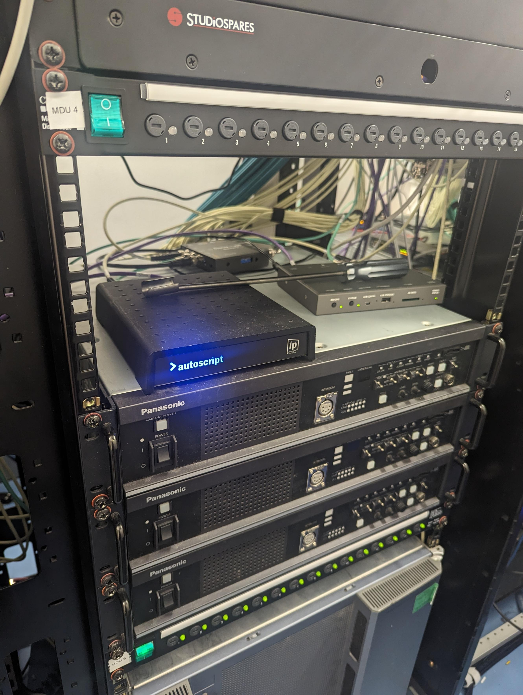
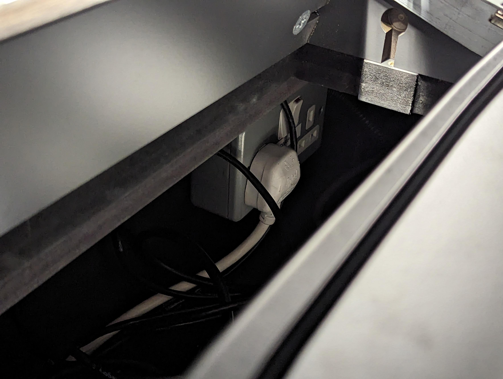

# Television Studio

## Startup and Shutdown Procedure

These steps are for a partial startup and shutdown. The TV Studio Technical Manager should be contacted for full startup and shutdown as there is critical infrastructure for DMM in the TV Studio. The shutdown procedure is the same as the startup procedure but in reverse.

### TAR

1. In the middle of the center rack Power on MDU 4. This will turn on the CCUs.

    

2. Underneath the CCUs, power on each power switch on the Sony vision mixer, one by one, a few seconds between each.

    

3. (Optional) Switch on the two monitors in the left rack using the red power buttons on the top of each monitor.

    

### PCR (Front Row)

1. In the rack closest to the TAR, turn on the vision mixer panel.

    

2. At the bottom of that rack, turn on the speaker amp.

    

3. Turn on any monitors that aren’t on.

### PCR (Back Row)

1. At the engineering position (far left), reach through the empty rack and switch on the mains switch on the rear panel to the right of the rack.

    

2. **To get the tally to work from the vision mixer correctly, the Vision Mixer device in Cerebrum needs to be refreshed:**

    1. Open Cerebrum on the Control PC (far left PC on the back row)

    2. On the left side in the device panel, navigate to the Vision Mixer device (this has an IP 0.0.0.2)

    3. Right-click on it and press ‘Edit Device’

    4. Press ‘Modify’ at the bottom of the window that opens and it should refresh the device and the tally should work.

### SCR

1. Behind the computer monitor to the right of the mixing desk, power on the sequential MDU. This will turn on all equipment in the room sequentially to prevent any current overload or loud pops coming through the speakers.

    

### VCR

1. Switch on the lighting desk using the power button on the rear right of the desk.

    

2. Switch on the lighting monitor.

3. Switch on the vision engineering monitor.

4. Switch on the TV using the remote.

## Operational Responsibilities

### Studio Director

- Decides format of the programme with the producer

- Creates the camera shots and positions for each part of the
    programme

- Works with the Lighting Director to decide on the appropriate lighting for the show

- Works with the Sound Supervisor to discuss sound, effects, music, and comms for the show
- Works with the set designer or for an existing show, uses existing set to best use for a particular programme

- Creates running order with the PA and Producer and creates the call sheet

- Co-ordinates with graphics and VT play-in

- Rehearses the studio before the show and decides on camera position and framing with the camera team

- Directs the vision mixer during rehearsal and leads them during the show

- Follows the script and running order of the programme

- Decides on the next shot, VT, graphic, or other source to be used next

- Stands by VT before running VT

- Warns the camera or graphics before the vision mixer cuts to it

- Stands by and cues presenter (sometimes PA)

- Cues digital video effects or animations on graphics

- Directs the cap-gens when called for from count from PA or the script

- Informs the studio team of any changes in the running order which may be a result of editorial changes from the producer

- Is in charge of the technical side of the studio

- Is responsible for the smooth running of the programme

- Takes technical decisions on the programme on advice from the technical manager

### Producer

- In charge of the content of the programme

- Works with the director to create the look of the programme

- Has editorial control of the order of the programme content
- The director can overrule the producer on technical grounds (normally)

- Talks to presenter on talk back

- Discusses timings of the programme with the PA and makes suitable adjustments

- Producer allocates assistant producer responsibility to stories or parts of stories

- Researchers provide research on stories for producers which is used by presenters, reporters, or assistant producers

### PA

The Production Assistant (PA) or Programme Coordinator (PC)...

- Works to the programme duration for live or recording

- Tests communications to the presenter
- Checks whether the presenter is working on open or switched talkback

- Works to running order which has all the durations of VTs, reads, and titles

- Keep track of programme timing and keep the producer informed whether there is an under-run or over-run

- Advises producer to make adjustments to get the timing back on track

- Times each of the items and informs the studio over talkback of the timing left on VT or interview or other live event

- Gives studio countdown to transmission or recording: 2 mins, 1 min, 30s, 20s, hard count 10-0, and then notes if the broadcast is on-air if it is live

- Gives director timings on VTs and graphics

- Keeps paperwork and music copyright for Programme as Broadcast (PAB)

### Presenter (Talent)

- Listens to the director over talkback (if available)

- Listens to the producer over talkback (if available)
- Talks to the director through their microphone if it is open or speaks to the floor manager who will relay to the director

- Has scripts ready to read and have researched subject and questions for interviews

- Will have make-up completed by the agreed call time
- Is in the studio by the agreed call time

- Puts on their talkback unit and earpiece if one is available

- Hears directions over talkback and/or visually from the floor manager

- Takes visual cues from the floor manager to start reading the script

- Takes visual cues for the camera from the floor manager

- Follows PA's talkback or floor manager’s hand signals to shorter or longer item duration

- Quiet by the time that they have been asked to, PA will count to stopping talking

- Pleasant to all technical staff

### Floor Manager

- Listens to the director over talkback

- Is the eyes and ears of the director on the studio floor
- Is responsible for health and safety on the studio floor

- Is in charge of the studio floor and co-ordinates with all personnel in that area

- Speaks loudly and clearly
- Normally a 30s warning for rehearsal or 2 minute warning for live recording

- Uses hand signals to give timing to on-air, off-air, and timings of items and interviews

- Verbal warning to transmission/recording 2 mins, 1 min, 30s, 20s, 10, 9, 8, 7, 6, 5 and 4s, only hand signals for 3, 2 and 1s. (knows the hand signals for all the timings)

- Knows hand signals to cue the presenter and extend or shorten their speech

### Camera Operator

## Operational Guides

### General

#### Comms

### Studio Floor

### Production Control Room

#### Producer Position

#### PA Position

#### Director Position

#### Vision Mixer

#### Engineer

#### Autocue

#### GFX

#### EVS (Record/Replay)

### Sound Control Room

#### Sound Mixer

#### Gram Operator/Comms Engineer

### Vision Control Room

#### Lighting Position

#### Vision Engineer

## Technical Reference

### Record/Replay, VT Playback and EVS

In the TV Studio, we have an EVS XT3 server with a machine running IP Director. The XT3 server is an 8-channel record/replay system where there are 8 channels available to either record or replay. The default configuration is six record channels and two replay channels (6x2). Having two replay channels is useful as we have two controllers (LSM) which can control each output.

The EVS records continuously on its record channels, sharing the remaining disk space equally; similar to how a CCTV system works. The addition of clips reduces the available record time.

All the record channels are routable from the Cerebrum control system, meaning any six sources can be recorded. Usually, this would be the main program output and the three studio cameras.

|                       |         6x2 ProRes         |   4x4 ProRes    | 6x2 DNxHD  | 4x4 DNxHD  |
| :-------------------- | :------------------------: | :-------------: | :--------: | :--------: |
| Record Channels       |             6              |        4        |     6      |     4      |
| Playback Channels     |             2              |        4        |     2      |     4      |
| Video Codec           |      ProRes 422 (SQ)       | ProRes 422 (SQ) | DNxHD 120  | DNxHD 120  |
| Audio Codec           |         PCM 48kHz          |    PCM 48kHz    | PCM 48kHz  | PCM 48kHz  |
| Video Wrapper         |            MOV             |       MOV       | MOV or MXF | MOV or MXF |
| Audio Record Input    | MADI from Calrec Brio desk |      MADI       |    MADI    |    MADI    |
| Audio Playback Output |  MADI to Calrec Brio desk  |      MADI       |    MADI    |    MADI    |
